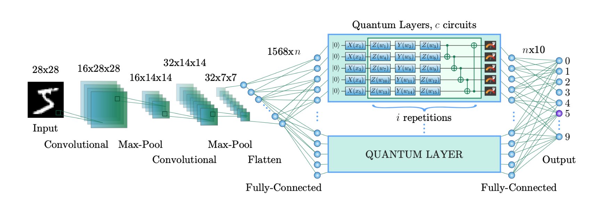

# Simple Block - Zero Or One Image Digit Classification (South Carolina Quantathon Competition)

## Introduction

This project was conducted as part of the IonQ Quantum Vision Challenge at South Carolina Quantathon which was hosted by the Darla Moore School of Business at the University of South Carolina. The objectivre of this project was to devise a quantum layer within a neural network that is designed to differentiate between the digits 0 and 1. The quantum layer in this architecture is expected to perform a different role compared to the traditional hybrid quantum-classical neural network where the training is done using a lot of the classical layers with just one or two quantum layers involved in the training process. The quantum layer here is expected to conduct most of the training on the data set. Below are figures to display the different sections of the architecture.

The image above showcases the pre-processing step of the algorithm. This aspect focuses on flattening the image into 784 vector while using PCA to reduce its size to 168 dimensions before being fed into the quantum layer.

The quantum layer is the section of the algorithm where all the training is going to take place. The scope of this project is to define an effective quantum layer that can yield meaningful reproducible results while training on a small set of data.

Finally, the post-processing step translates the outputs from the quantum layer into 0 or 1 by working with a fully connected layer to produce a value of 0 or 1 in the last output neuron.

## Problem Statement

With the emergence of Quantum Computing and its potential to tackle complex computations, research on newer domains such as quantum machine learning and quantum optimization are being rigorously conducted with the expectation of developing newer ideas for tackling problems that we have always struggled with. Although quantum machine learning is not as great as its classical counterparts, there is a lot of room for improvement when it comes to innovating within the field. Therefore, the major objective of this project is to develop a quantum circuit that can pave way for future development within the quantum machine learning ecosystem.

## Methodology

The methodology was to develop a quantum layer that can act as a component within the neural network. Our objective was three-fold: simplicity, training speed and reproduciboility. This quantum layer will be simple while being able to yield reproducible results and training data within a reasonable period of time. Therefore, we began by transforming the initial circuit into a simpler circuit by replacing the Angle Encoder with the ZFeatureMap, a simpler data encoding mechanism. We also used a new method for convolution by drawing inspiration from Qiskit's [tutorial](https://qiskit-community.github.io/qiskit-machine-learning/tutorials/11_quantum_convolutional_neural_networks.html) on Quantum Convolution Neural Network.

After struggling to get a stabilized result with the algorithm above, it was crucial to explore simpler methods. Moreover, the algorithm above took a long period to train (about 200 seconds per epoch). As this project was part of a 24-hour hackathon, results needed to be obtained immediately so they can be used to improve the model. Hence, simplicity was very essential. 

#### HQNN

Two propositions were made for improving the model. The first one focused on using the HQNN layer that A Senokosov et. al used in their [paper](https://arxiv.org/abs/2304.09224) that came out in 2024. Below are two images highlighting the first method.

Above is an image of what the HQNN architecture would look like

Here is an image of HQNN being rendered via Qiskit

#### Z-Feature Map + TwoLocal

The second idea was to utilize a simplistic variational algorithm that can be easily tweaked while producing quick immediate results. Below is an image of this quantum circuit layout. This quantum circuit utilizes a ZFeatureMap for its data encoding process and a Two Local Quantum Circuit for its ansatz.

The Z-Feature Map:

The TwoLocal Ansatz: 

## Solution

The method that yielded the better result was the combination of the ZFeatureMap and TwoLocal. However, there was an opportunity to experiment and see if an even smaller version can yield remarkable results. Hence, the number of qubits was reduced from 4 to 2. 

## Results

The results above indicate that the ZFeatureMap and TwoLocal combo provided a better result. Although the HQNN is simpler, it is not complex enough to act as a building block. The ZFeatureMap-TwoLocal combo definitely strikes a balance between simplicity and complexity as a more complex algorithm such as a QConv might occassionally provide higher accuracy but it was too complex to tweak and upgrade. The ZFeatureMap-TwoLocal combo also provided consistently good results on the leaderboard. It produced 62% twice and a score of **65%** once.

## Conclusion

This was a great project to dive deep into the intricacies of building a quantum algorithm that can act as a model for training data while witnessing certain machine learning concepts such as hyper-parameter tuning and bias-variance tradeoff. Since quantum computers leverage principles such as superposition, interference and entanglement, they have the capacity to solve complex problems that some classical systems struggle with. Therefore, looking into quantum machine learning as a possible way for developing the new generation of machine learning algorithms is an experimental initiative to test the limits of quantum computing in the real world, and know how it can possibly enhance the domain of machine learning. 

## References

- Liu, Bo, et al. "Quantum Convolutional Neural Networks: A Survey." arXiv, 2023, https://arxiv.org/pdf/2304.09224.
- Qiskit Community. "Quantum Convolutional Neural Networks." Qiskit Machine Learning Tutorials, https://qiskit-community.github.io/qiskit-machine-learning/tutorials/11_quantum_convolutional_neural_networks.html
- IBM Quantum. (n.d.). ZFeatureMap. IBM Quantum Documentation. Retrieved October 12, 2024, from https://docs.quantum.ibm.com/api/qiskit/qiskit.circuit.library.ZFeatureMap
- IBM Quantum. (n.d.). TwoLocal. IBM Quantum Documentation. Retrieved October 12, 2024, from https://docs.quantum.ibm.com/api/qiskit/qiskit.circuit.library.TwoLocal

